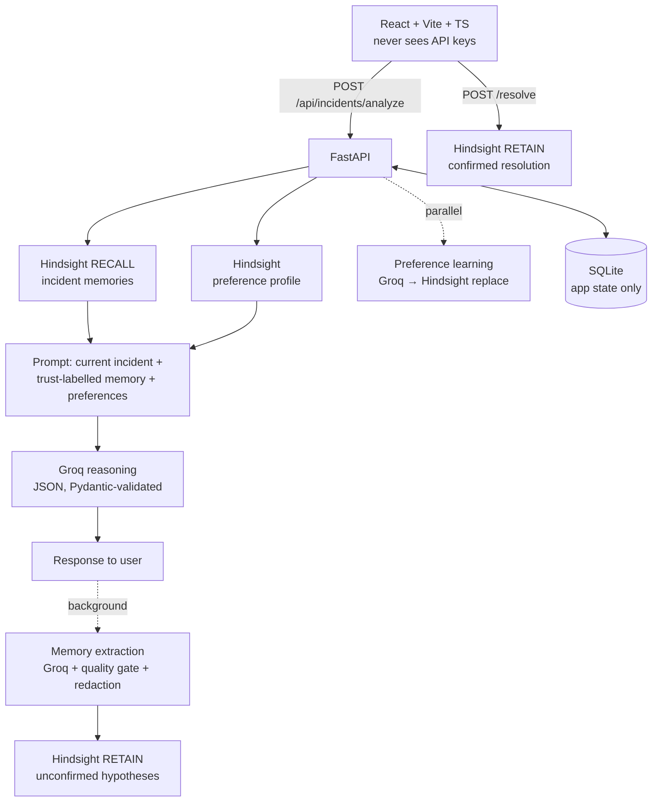

# Incident Response Agent — learns from every incident with Hindsight

An AI incident-response agent that **remembers previous incidents** — symptoms, error signatures, confirmed root causes, fixes that worked, fixes that failed and outcomes — using **[Hindsight](https://hindsight.vectorize.io/)**, and reasons over that experience with **Groq** when a similar incident happens again.

Built for HackwithHyderabad 3.0.

```text
A production incident happens → Hindsight remembers relevant experience → the agent reasons over it
→ the resolution becomes durable knowledge → the next incident benefits from what was learned
```

## Contents
1. [Why incident response needs memory](#why-incident-response-needs-memory)
2. [Architecture](#architecture) · [Request flow](#request-flow) · [Memory lifecycle](#memory-lifecycle)
3. [Setup](#setup) · [Environment variables](#environment-variables) · [Testing](#testing) · [Deployment](#deployment)
4. [API](#api) · [Security model](#security-model) · [Failure handling](#failure-handling) · [Performance](#performance--observability)
5. [Demo walkthrough](#demo-walkthrough)

## Why incident response needs memory

When production breaks, the knowledge needed to fix it usually already exists: someone fixed something similar last month. That knowledge is scattered across Slack threads, postmortems and people's heads, so on-call engineers start from scratch. A generic LLM makes this worse — plausible, generic advice with no idea what *your* systems did before.

**Why Hindsight:** it gives the agent a persistent, per-user memory bank with semantic recall, reranking, tags and metadata, so the agent can (a) retrieve only the relevant past incidents, (b) tell *confirmed* knowledge from *hypotheses*, and (c) keep user preferences separate from incident knowledge. Hindsight is the **only** agent memory; SQLite is plain application state.

| Store | Holds | Read by the agent as memory? |
|---|---|---|
| **Hindsight** (one private bank per user) | Confirmed resolutions, auto-extracted hypotheses, the user's preference profile | **Yes** — every analysis starts with a Hindsight recall |
| **SQLite** | Users (PBKDF2 hashes), sessions (SHA-256 token hashes), incident list/history, background-learning status | No |

## Architecture



```text
backend/app/
  main.py                  app, CORS, DB-error handler, /api/health (cached)
  config.py                all settings (env / .env)
  auth.py                  hashing, hashed sessions with expiry, current_user
  db.py                    SQLite schema + migrations (application state only)
  schemas.py               typed request/response contracts
  redaction.py             secret / PII redaction for memory and logs
  observability.py         per-stage timer, secret-redacting log filter
  api/auth.py, api/incidents.py         HTTP routes
  agent/incident_agent.py  RECALL → REASON loop, background LEARN → RETAIN
  agent/memory_extractor.py  what is worth remembering + memory-quality gate
  agent/preference_learner.py  add / update / remove / learn preferences
  hindsight/client.py      recall shaping, relevance, trust ranking, retain
  hindsight/preferences.py preference profile document
  groq/client.py           pooled Groq client, retries, error mapping
backend/tests/             pytest suite (fake Hindsight + mocked Groq transport)
frontend/src/
  services/api.ts          the only place that talks to the backend
  hooks/useLearningStatus.ts  bounded polling of background learning
  components/              MemoryPanel, AnalysisPanel, LearningPanel, ResolutionPanel, …
```

## Request flow

`POST /api/incidents/analyze`

| Step | What happens | Runs |
|---|---|---|
| 1 RECALL | Hindsight `arecall` on the user's bank, tag-filtered to incident memories, 15 s budget · Hindsight preference profile | **in parallel** |
| 2 REASON | Groq analysis (JSON mode, validated; retried once only on malformed output) · preference learning (only if the user wrote instructions) | **in parallel** |
| 3 | Incident row written to SQLite, response returned with per-stage metrics | |
| 4 LEARN → RETAIN | Groq extracts durable knowledge → quality gate → Hindsight retain as *unconfirmed* | **background**, status at `GET /api/incidents/{id}/learning` |

`POST /api/incidents/{id}/resolve` retains the engineer-confirmed resolution (idempotent `document_id`), which then outranks hypotheses on recall.

## Memory lifecycle

| Kind | Written when | Trust | Document |
|---|---|---|---|
| **Confirmed resolution** | Engineer saves the real root cause / fix / outcome | High (`+0.2` ranking bonus, labelled *CONFIRMED* to Groq) | `<incident id>` |
| **Hypothesis** | Automatically after each analysis | Low (labelled *UNCONFIRMED*; "Suspected…", "Recommended…") | `<incident id>:analysis` |
| **Preference profile** | User states a lasting preference / changes / cancels it | Applied to every response; current instructions override it | `user-preference-profile` (`update_mode="replace"`) |

Memory-quality rules (all tested):
* **Never stored:** raw logs (log-line / verbatim-copy detection), secrets and PII (redacted), temporary style requests, the model's own advice posing as a team rule, UI/login activity.
* **No duplicates:** near-duplicate detection (word-set Jaccard ≥ 0.8) against what recall already returned and within the batch; recalled facts are de-duplicated per incident.
* **One-off instructions** ("be brief this time") become a learned preference only after 3 separate reports.
* **Relevance:** other-service memories need reranker score ≥ 0.3; same-service ≥ 0.1; at most 3 incidents × 4 facts reach Groq. Each recalled incident shows **why** it was recalled: same service, same environment, similar error signature, similar recent change, shared symptoms, semantic score.
* **No invented history:** if recall was empty or failed, `historical_matches` is forced to `[]`.

## Setup

Requirements: Python 3.11+ and Node 20+.

```bash
# Backend (terminal 1)
cd backend
cp .env.example .env              # then add GROQ_API_KEY and HINDSIGHT_API_KEY
python -m venv .venv
# Windows: .venv\Scripts\activate    macOS/Linux: source .venv/bin/activate
pip install -r requirements-dev.txt   # or requirements.txt for runtime only
uvicorn app.main:app --reload --port 8000

# Frontend (terminal 2)
cd frontend
npm install
npm run dev                       # http://localhost:5173, /api is proxied to :8000
```

Click **Create account**: each account starts with an empty history and its own private Hindsight bank.

### Environment variables

| Variable | Default | Purpose |
|---|---|---|
| `GROQ_API_KEY` | — | **Secret.** Backend only. |
| `GROQ_MODEL` | `openai/gpt-oss-120b` | Any Groq chat model |
| `GROQ_AUX_REASONING_EFFORT` | `low` | Effort for extraction/preference calls (sent only to models that support it) |
| `HINDSIGHT_API_KEY` | — | **Secret.** Backend only. |
| `HINDSIGHT_BASE_URL` | Hindsight Cloud | SDK base URL |
| `HINDSIGHT_BANK_ID` | `incident-response-agent` | Prefix; each user gets `<prefix>-u-<user_id>` |
| `HINDSIGHT_RECALL_TIMEOUT_SECONDS` | `15` | Critical-path recall budget |
| `HINDSIGHT_MIN_RELEVANCE` / `…_SAME_SERVICE` | `0.3` / `0.1` | Relevance thresholds |
| `RECALL_MAX_INCIDENTS` / `RECALL_MAX_FACTS_PER_INCIDENT` | `3` / `4` | Prompt budget |
| `CORS_ORIGINS` | localhost + deployed frontend | Comma-separated |
| `SESSION_TTL_HOURS` | `168` | Session lifetime |
| `EXPOSE_METRICS` | `true` | Include latency/token metrics in responses |
| `DATABASE_PATH` | `backend/incidents.db` | SQLite file (git-ignored) |
| `VITE_API_URL` (frontend) | dev: same origin · prod: Render URL | Backend URL. **Not a secret**; no other `VITE_*` variables exist. |

## Testing

```bash
cd backend && pytest                    # 117 tests, ~7 s, no network or keys needed
cd frontend && npm test                 # 15 tests (vitest + Testing Library)
RUN_LIVE_TESTS=1 pytest -m live -s      # optional: real Groq + Hindsight, prints stage latencies
```

External services are replaced only at their boundaries so all our own code runs: a **FakeHindsight** implements the SDK methods with real per-bank storage, tag filtering and keyword relevance scores; Groq is mocked at the **httpx transport**, so the real client, retries and parsing are exercised.

| Area | Examples of what is verified |
|---|---|
| **Memory loop** (`test_memory_loop.py`) | Incident A → analyze → resolve → retain; Incident B recalls A as *confirmed*, with root cause, failed approaches and "why relevant", and A reaches the Groq prompt; first incident has no invented history; hypothesis vs confirmed; irrelevant memories hidden; per-user isolation |
| Auth | register/login/logout, invalid login indistinguishable, 401 on every protected route, expired sessions, tokens stored hashed |
| Failures | Groq down/timeout/401/malformed (retried once, not more), Hindsight down/slow (time budget), retain failure retryable, extraction failure keeps analysis, DB error → 503 |
| Preferences | stored → applied later, changed → replaced, cancelled → removed, one-off not permanent until repeated, current instruction overrides |
| Security | redaction table, secrets absent from every response and from logs, cross-user 404s, SQL-injection ids, prompt-injection boundary, resolution + auto memory redacted, raw logs not retained |
| Latency | recall ‖ preferences and analysis ‖ preference learning overlap; extraction off the critical path; bank creation de-duplicated; health cached |

Quality gates (also in `.github/workflows/ci.yml`): `ruff check app tests`, `mypy`, `pytest`, `pip-audit`, `npm run lint`, `npm run typecheck`, `npm test`, `npm run build`, bundle secret scan, `npm audit`.

## Deployment

* **Backend (Render):** start command `uvicorn app.main:app --host 0.0.0.0 --port $PORT`; set `GROQ_API_KEY`, `HINDSIGHT_API_KEY` and `CORS_ORIGINS` as environment variables. Use a persistent disk (or accept that SQLite state resets on redeploy — agent memory lives in Hindsight and survives).
* **Frontend (Vercel):** `npm run build`, output `dist`; set `VITE_API_URL` to the backend URL.

## API

| Method | Path | Purpose |
|---|---|---|
| POST | `/api/auth/register` | Create account (+ private Hindsight bank) |
| POST | `/api/auth/login` · `/logout` | Bearer session (stored hashed, expires) |
| GET | `/api/auth/me` | User, memory-bank size, active preferences |
| POST | `/api/incidents/analyze` | RECALL → REASON; returns analysis, recall, preferences, metrics |
| GET | `/api/incidents/{id}/learning` | Background LEARN → RETAIN status (`pending`/`stored`/`skipped`/`error`) |
| POST | `/api/incidents/{id}/resolve` | Retain the confirmed resolution |
| GET | `/api/incidents` · `/api/incidents/{id}` | History / detail (owner only) |
| GET | `/api/incidents/{id}/memories` | What was recalled + the exact Groq prompt |
| GET | `/api/health` | Configuration + Hindsight reachability (cached 30 s, no keys) |

## Security model

* **Keys stay server-side.** The browser talks only to FastAPI; a test scans the frontend source and CI scans the built bundle for Groq/Hindsight URLs and key patterns.
* **Isolation.** Every SQL query filters by `user_id` (foreign incidents → 404); every Hindsight call uses the bank derived server-side from the session — the client can't choose a bank.
* **Sessions.** 256-bit random tokens, stored as SHA-256 hashes, with expiry; PBKDF2-SHA256 (200k) passwords; constant-cost login for unknown users. Blocking crypto/DB work runs off the event loop.
* **Memory hygiene.** Redaction of passwords, tokens, API keys (incl. quoted JSON), Bearer/Basic auth, JWTs, private keys, credentialed URLs, e-mails and card numbers before anything is retained; error logs are reduced to a short redacted *signature*.
* **Prompt injection.** Incident text and memory are fenced in `<current_incident>` / `<historical_memory>` data sections that user text cannot close; the system prompt says data is never instructions.
* **Errors & logs.** Upstream error bodies are logged, never returned; a log filter scrubs configured secrets and secret-looking strings; incident content is never logged.
* **CORS** limited to configured origins, `GET`/`POST`, `Authorization`/`Content-Type`.

## Failure handling

| Failure | Behaviour |
|---|---|
| Hindsight down / slow | Analysis continues; UI says *"Historical memory was unavailable"*; no history is invented |
| Groq down / timeout / rate limit / bad key | Clear 503 / 504 / 429 / 502; nothing stored |
| Malformed model output | One retry, then 502 |
| Background learning fails | Analysis unaffected; learning status shows `error` |
| Resolution retain fails | 502, incident **not** marked retained, safe to retry |
| Preference store down | Analysis continues; preferences marked unavailable |
| Database error | 503 with a generic message |

## Performance & observability

Every analysis returns (and logs, without content) a breakdown such as:

```json
"metrics": {"total_ms": 1834, "stages_ms": {"hindsight_recall": 320, "preferences_load": 180,
  "groq_analysis": 1210, "preference_learning": 0, "db_write": 4},
  "memories_recalled": 1, "facts_in_prompt": 4, "prompt_tokens": 610, "completion_tokens": 240}
```

The background step reports `memory_extraction` and `hindsight_retain` timings on `/learning`; resolve reports `retain_ms`. The UI shows the breakdown under **Latency** in the analysis panel. What changed on the critical path, versus the previous version:

* Memory extraction (a whole Groq call) and its Hindsight retain moved **after** the response.
* Preference learning runs **concurrently** with the analysis instead of after it.
* One pooled HTTP client for Groq (no TLS handshake per call); `reasoning_effort=low` on auxiliary calls.
* Smaller prompt: recall `max_tokens` 4096 → 2048, ≤ 3 incidents × 4 facts, logs capped at 3 000 chars, duplicated instructions removed.
* Recall has a time budget; bank creation is de-duplicated; `/api/health` is cached; login no longer waits for Hindsight.

## Demo walkthrough

Use a new account so the first incident starts with an empty memory. **Demo #1** / **Demo #2** buttons fill the forms.

**First incident — no memory yet** (`payment-api`, *"Payment API latency is very high"*, `RedisConnectionPool: connection pool exhausted (max=50)`)
1. **Analyze Incident.** *1 · Recall* says *no relevant previous incidents*; *2 · Reason* has no historical matches.
2. *3 · Learn* shows what the agent kept as **unconfirmed hypotheses** (e.g. "Suspected root cause (unconfirmed): …").
3. *4 · Confirm & Retain*: **Yes, save resolution** — root cause `Redis connection pool exhaustion`, solution `Increased Redis connection pool size from 50 to 150`, outcome `Latency returned to normal`, didn't work `Restarting pods only helped for 10 minutes`.

**Second, similar incident** (`payment-api`, *"Payment requests are slow again"*, `Redis timeout after 2000ms`, *"Traffic increased by 40%"*)
1. *1 · Recall* shows the first incident with a **✓ Confirmed resolution** badge, its fix and what failed, and **why it was recalled** (same service, same environment, similar error signature, semantic score) — under the banner *"Historical memory is evidence, not the answer."*
2. *2 · Reason* compares them: similarities (Redis, payment-api latency) and **differences** (timeouts rather than exhaustion; 40% more traffic, so a pool sized for the old load may be too small again), and advises against the pod restart that failed last time.
3. **Show exact prompt** proves Groq received the current incident *and* the trust-labelled memory. **Latency** shows the per-stage timings.

**How Hindsight improved the second analysis:** without memory, the agent can only guess generically at Redis tuning. With memory it starts from a *verified* root cause, avoids a known-failed fix, and focuses on what's new (load growth) — faster and more specific triage.

**Preferences:** write *"From now on, end every summary with OK"* in Additional Instructions → *3 · Learn* shows **Added**; later reports end with OK without asking. *"Stop ending summaries with OK"* removes it. *"Be brief this time"* is not stored.

The agent only analyzes and recommends. It never runs commands against production.
