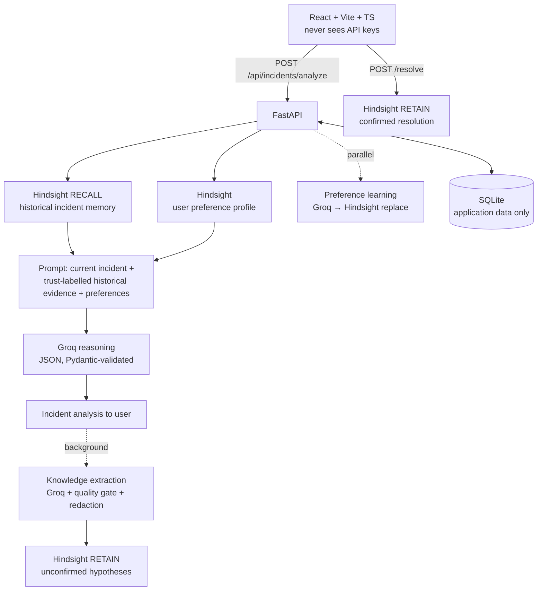

# AI Incident Response Agent with Persistent Memory for Learning from Previous Resolutions

An AI incident-response agent that **remembers previous production incidents**: symptoms, error signatures, confirmed root causes, resolutions that worked, failed approaches and outcomes. It uses **[Hindsight](https://hindsight.vectorize.io/)** as persistent agent memory and reasons over that historical evidence with **Groq** when a similar incident happens again.

Built for HackwithHyderabad 3.0.

```text
Production incident → Hindsight RECALL of relevant historical incidents → Groq REASONING over current incident + historical evidence
→ incident analysis → automatic knowledge EXTRACTION → Hindsight RETAIN → the next recurring incident benefits
```

> **Core principle: historical memory is evidence, not the answer.** The agent compares the current incident with what it remembers and explains similarities and differences before it recommends anything. It never repeats a previous fix blindly.

## Contents
1. [Problem statement](#problem-statement) · [Why stateless incident analysis is insufficient](#why-stateless-incident-analysis-is-insufficient) · [Solution](#solution)
2. [Architecture](#architecture) · [Component roles](#component-roles) · [Recall → Reason → Extract → Retain](#recall--reason--extract--retain)
3. [Confirmed vs unconfirmed memory](#confirmed-vs-unconfirmed-memory) · [User preference memory](#user-preference-memory) · [Per-user memory isolation](#per-user-memory-isolation)
4. [Failure handling](#failure-handling) · [Security](#security) · [Performance](#performance--observability)
5. [Setup](#setup) · [Environment variables](#environment-variables) · [Deployment](#deployment) · [Testing](#testing) · [API](#api)
6. [Demonstration: before vs after persistent memory](#demonstration-before-vs-after-persistent-memory) · [Demo walkthrough](#demo-walkthrough)
7. [SDG 9 alignment](#sdg-9-alignment-industry-innovation--infrastructure)

## Problem statement

Production incidents often recur with similar symptoms, error patterns and service-level failures, but conventional incident-response assistants analyze each incident independently, without retaining useful knowledge from previous resolutions.

This project is an AI incident-response agent with persistent memory. When it analyzes a new incident, it recalls relevant historical incidents, root causes, resolutions, failed approaches and outcomes.

* **Input:** a production incident: title, service, environment, severity, symptoms, error logs, recent changes and optional additional instructions (`IncidentInput` in `backend/app/schemas.py`).
* **Recall:** Hindsight provides semantic recall of relevant historical incident knowledge from the user's own memory bank.
* **Reason:** a Groq-hosted LLM analyzes the current incident together with the recalled memory. It compares the historical and current incidents, identifies similarities and differences, recommends diagnostic checks and a possible solution, and treats historical information as evidence rather than automatically repeating previous fixes.
* **Learn:** after the analysis, the agent automatically extracts durable incident-response knowledge and retains it in Hindsight for future incidents. **Confirmed resolutions** (saved by an engineer) are kept separate from **unconfirmed hypotheses** (extracted automatically). Over time the agent builds reusable operational knowledge, and each user's memory is isolated.
* **Stack:** FastAPI backend, Hindsight persistent memory, Groq reasoning, SQLite for application-level data, React frontend.

## Why stateless incident analysis is insufficient

When production breaks, the knowledge needed to fix it often already exists: someone fixed something similar last month. That knowledge is scattered across chat threads, postmortems and people's heads, so on-call engineers start from scratch. A stateless LLM assistant makes this worse. It gives plausible, generic advice and has no idea what *your* systems did before, which fix worked, or which approach already failed.

| Stateless assistant | This agent |
|---|---|
| Every incident starts from zero | Recalls relevant historical incidents from Hindsight |
| May suggest a fix that already failed | Sees previous **failed approaches** and advises against repeating them |
| Cannot tell verified knowledge from guesses | Labels memory **CONFIRMED** (engineer-verified) or **UNCONFIRMED** (hypothesis) and ranks accordingly |
| Knowledge is lost when the chat ends | Durable knowledge is extracted and retained automatically after every analysis |

## Solution

| Store | Holds | Read by the agent as memory? |
|---|---|---|
| **Hindsight** (one private bank per user) | Confirmed resolutions, automatically extracted incident knowledge (unconfirmed hypotheses), the user's preference profile | **Yes.** Every analysis starts with a Hindsight recall |
| **SQLite** | Users (PBKDF2 hashes), sessions (SHA-256 token hashes), incident list/history, background-learning status | No, application-level data only |

Hindsight is the **only** agent memory. SQLite is never read as memory.

## Architecture

```text
User
 ↓
React (never sees API keys)
 ↓
FastAPI (backend orchestration)
 ↓
Hindsight RECALL ─────────────────────────────┐
 ↓                                            ↓
Historical incident memory          +   User preference memory
 ↓                                            ↓
Groq reasoning (current incident + historical evidence + preferences + current instructions)
 ↓
Incident analysis → returned to the user
 ↓  (background, off the critical path)
Automatic knowledge extraction (Groq + memory-quality gate + redaction)
 ↓
Hindsight RETAIN (unconfirmed hypotheses)          Engineer confirms resolution → Hindsight RETAIN (confirmed)
```



```text
backend/app/
  main.py                      app, CORS, DB-error handler, /api/health (cached)
  config.py                    all settings (environment variables / backend/.env)
  auth.py                      password hashing, hashed sessions with expiry, current_user
  db.py                        SQLite schema + migrations (application-level data only)
  schemas.py                   domain model: IncidentInput, ResolutionInput, RecalledIncident,
                               IncidentAnalysis, HistoricalMatch, AutoMemoryItem, KnowledgeCategory …
  redaction.py                 secret / PII redaction for memory and logs
  observability.py             per-stage timer, secret-redacting log filter
  api/auth.py, api/incidents.py    HTTP routes
  agent/incident_agent.py      RECALL → REASON, then background EXTRACT → RETAIN
  agent/memory_extractor.py    automatic knowledge extraction + memory-quality gate
  agent/preference_learner.py  add / update / remove / learn user preferences
  hindsight/client.py          semantic recall, relevance, trust ranking, retain
  hindsight/preferences.py     user preference profile document
  groq/client.py               pooled Groq client, retries, error mapping
backend/tests/                 pytest suite (fake Hindsight + mocked Groq transport)
frontend/src/
  services/api.ts              the only place that talks to the backend
  components/                  MemoryPanel, AnalysisPanel, LearningPanel, ResolutionPanel, …
```

## Component roles

| Component | Role |
|---|---|
| **Hindsight** | Persistent agent memory: semantic recall and retention of historical incidents and user preferences |
| **Groq** | Reasoning and analysis: incident comparison, recommendations, knowledge extraction, preference learning |
| **SQLite** | Application-level data: accounts, sessions, incident history, learning status |
| **FastAPI** | Backend orchestration: auth, validation, the Recall → Reason → Extract → Retain loop, concurrency |
| **React** | User interface: incident form, Hindsight memory panel, analysis, learning status, resolution form |

## Recall → Reason → Extract → Retain

`POST /api/incidents/analyze`

| Step | What happens | Runs |
|---|---|---|
| 1 RECALL | Hindsight `arecall` on the user's bank, tag-filtered to incident memories, 15 s budget · Hindsight preference profile | **in parallel** |
| 2 REASON | Groq analysis (JSON mode, validated; retried once only on malformed output) · preference learning (only if the user wrote instructions) | **in parallel** |
| 3 | Incident row written to SQLite, response returned with per-stage metrics | |
| 4 EXTRACT → RETAIN | Groq extracts durable knowledge → quality gate → Hindsight retain as *unconfirmed* | **background**, status at `GET /api/incidents/{id}/learning` |

`POST /api/incidents/{id}/resolve` retains the engineer-confirmed resolution (idempotent `document_id`). On recall it outranks hypotheses.

What the reasoning step receives (see **Show exact prompt sent to Groq** in the UI): the current incident, the recalled historical incidents with their trust label (`CONFIRMED resolution` / `UNCONFIRMED hypothesis`), root cause, fix, outcome, failed approaches, error signature and recent changes, plus user preferences and current instructions. The system prompt tells Groq to compare, state differences, say whether a previous fix still applies, weigh unconfirmed memory less, and never invent history.

**Durable knowledge categories** (`KnowledgeCategory` in `schemas.py`): `root_cause`, `resolution`, `diagnostic_finding`, `incident_pattern`, `service_knowledge`, `configuration_lesson`, `team_instruction`.

Memory-quality rules (all tested):
* **Never stored:** raw logs (log-line / verbatim-copy detection), secrets and PII (redacted), temporary style requests, the model's own advice posing as a team rule, UI/login activity.
* **No duplicates:** near-duplicate detection (word-set Jaccard ≥ 0.8) against what recall already returned and within the batch. Recalled facts are de-duplicated per incident.
* **One-off instructions** ("be brief this time") become a learned preference only after 3 separate reports.
* **Relevance:** memories from other services need reranker score ≥ 0.3, same-service ≥ 0.1. At most 3 incidents × 4 facts reach Groq. Each recalled incident shows **why it is relevant**: same service, same environment, similar error signature, similar recent change, shared symptoms, semantic score.
* **No invented history:** if recall was empty or failed, `historical_matches` is forced to `[]`.

## Confirmed vs unconfirmed memory

```text
CONFIRMED                                   UNCONFIRMED
Incident                                    Incident
 ↓                                           ↓
Root cause confirmed by an engineer         Possible root cause (from the analysis)
 ↓                                           ↓
Solution applied                            Recommended solution
 ↓                                           ↓
Outcome verified                            Not confirmed
 ↓                                           ↓
Retained as confirmed knowledge             Retained as "Suspected … (unconfirmed)"
document "<incident id>"                    document "<incident id>:analysis"
```

| Kind | Written when | Trust | Hindsight document |
|---|---|---|---|
| **Confirmed resolution** | Engineer saves the real root cause / fix / outcome / failed approaches | High (`+0.2` ranking bonus, labelled *CONFIRMED* to Groq and in the UI) | `<incident id>`, `memory_source=confirmed-resolution` |
| **Unconfirmed hypothesis** | Automatically after each analysis | Low (labelled *UNCONFIRMED*; "Suspected…", "Recommended…") | `<incident id>:analysis`, `memory_source=auto-analysis` |

Classification fails closed (`is_confirmed_resolution` in `hindsight/client.py`). A memory counts as confirmed only if it is not marked `auto-analysis` and is not an `:analysis` document, and `RecalledIncident.confirmed` defaults to `False`. An unconfirmed hypothesis can therefore never be shown as a confirmed historical resolution. The UI spells out **✓ CONFIRMED** / **⚠ UNCONFIRMED** in text, so the status doesn't depend on colour alone.

## User preference memory

Two separate memory domains live in the user's bank:

| Incident memory | User preference memory |
|---|---|
| Root causes, resolutions, failed approaches, diagnostic findings, incident patterns, service knowledge, configuration lessons, team instructions | Explanation style, detail level, response format, language, formatting |
| Tagged `kind:incident-resolution`, and recall searches only this tag | One `user-preference-profile` document (`update_mode="replace"`) |

Preferences are **added**, **updated** (replaced) and **removed** when the user says so ("From now on…", "Stop…"). Temporary requests ("be brief this time") are not stored unless repeated 3 times. Current instructions override stored preferences. Preferences never become incident facts.

## Per-user memory isolation

* Every Hindsight call uses a bank id derived **server-side** from the authenticated session (`<prefix>-u-<user_id>`). The client can't choose a bank.
* Every SQL query filters by `user_id`, so another user's incidents return 404.
* Tested: user B's analysis never queries user A's bank, cross-user incident access returns 404, and each account starts with an empty history.

## Failure handling

| Failure | Behaviour |
|---|---|
| Hindsight down / slow | Analysis continues. UI: *"Hindsight memory is temporarily unavailable. The incident can still be analyzed without historical memory."* No history is invented |
| Groq down / timeout / rate limit / bad key | Clear 503 / 504 / 429 / 502; nothing stored |
| Malformed model output | One retry, then 502 |
| Background learning fails | Analysis unaffected; learning status shows `error` |
| Resolution retain fails | 502, incident **not** marked retained, safe to retry |
| Preference store down | Analysis continues; preferences marked unavailable |
| Database error | 503 with a generic message |

The agent only analyzes and recommends. It never runs commands against production.

## Security

* **Credentials only in environment variables, backend only.** `GROQ_API_KEY` and `HINDSIGHT_API_KEY` are read by `backend/app/config.py` from the environment (or the git-ignored `backend/.env`). The browser talks only to FastAPI. A test scans the frontend source, and CI scans the built bundle for Groq/Hindsight URLs and key patterns.
* **No credentials in the repository.** `backend/tests/test_repository_hygiene.py` scans every git-tracked file for credential patterns (connection strings with inline passwords, provider tokens, private keys, JWTs, AWS keys) and fails if `.env`, `*.db`, private keys or `.ollama/` are tracked. Test-only fake secrets live in `backend/tests/fake_secrets.py` and are assembled at runtime. `.env.example` contains placeholders only.
* **SQLite needs no credentials:** `DATABASE_PATH` is a local file path (git-ignored).
* **Isolation.** See [Per-user memory isolation](#per-user-memory-isolation).
* **Sessions.** 256-bit random tokens, stored as SHA-256 hashes, with expiry; PBKDF2-SHA256 (200k) passwords; constant-cost login for unknown users. Blocking crypto/DB work runs off the event loop.
* **Memory hygiene.** Before anything is retained, the agent redacts passwords, tokens, API keys (incl. quoted JSON), Bearer/Basic auth, JWTs, private keys, credentialed URLs, e-mails and card numbers. Error logs are reduced to a short redacted *signature*. Secrets are never stored as memory.
* **Prompt injection.** Incident text and memory are fenced in `<current_incident>` / `<historical_memory>` data sections that user text can't close. The system prompt says that data is never instructions.
* **Errors & logs.** Upstream error bodies are logged, never returned. A log filter scrubs configured secrets and secret-looking strings. Incident content is never logged.
* **CORS** is limited to configured origins, `GET`/`POST`, and `Authorization`/`Content-Type`.
* **Git history note.** An early commit (`61a2992`) contained the application database `backend/incidents.db`. Its plaintext session tokens were invalidated by the migration to hashed sessions (`db.py` drops the old table). The file also held PBKDF2 password hashes and incident text. Treat those accounts' passwords as exposed and reset them. To remove the file from history, rewrite it (e.g. `git filter-repo --path backend/incidents.db --invert-paths`) and force-push. No real API key has ever been committed.

## Performance & observability

Every analysis returns (and logs, without content) a breakdown such as:

```json
"metrics": {"total_ms": 1834, "stages_ms": {"hindsight_recall": 320, "preferences_load": 180,
  "groq_analysis": 1210, "preference_learning": 0, "db_write": 4},
  "memories_recalled": 1, "facts_in_prompt": 4, "prompt_tokens": 610, "completion_tokens": 240}
```

* Knowledge extraction (a whole Groq call) and its Hindsight retain run **after** the response.
* Preference learning runs **concurrently** with the analysis. Recall and preference loading run concurrently.
* One pooled HTTP client for Groq; `reasoning_effort=low` on auxiliary calls.
* Bounded prompt: recall `max_tokens` 2048, ≤ 3 incidents × 4 facts, logs capped at 3 000 chars.
* Recall has a time budget; bank creation is de-duplicated; `/api/health` is cached.

## Setup

Requirements: Python 3.11+ and Node 20+.

```bash
# Backend (terminal 1)
cd backend
cp .env.example .env              # then add GROQ_API_KEY and HINDSIGHT_API_KEY
python -m venv .venv
# Windows: .venv\Scripts\activate    macOS/Linux: source .venv/bin/activate
pip install -r requirements-dev.txt   # or requirements.txt for runtime only
uvicorn app.main:app --reload --port 8000

# Frontend (terminal 2)
cd frontend
npm install
npm run dev                       # http://localhost:5173, /api is proxied to :8000
```

Click **Create account**. Each account starts with an empty history and its own private Hindsight bank.

### Environment variables

| Variable | Default | Purpose |
|---|---|---|
| `GROQ_API_KEY` | — | **Secret.** Backend only. |
| `GROQ_MODEL` | `openai/gpt-oss-120b` | Any Groq chat model |
| `GROQ_AUX_REASONING_EFFORT` | `low` | Effort for extraction/preference calls (sent only to models that support it) |
| `HINDSIGHT_API_KEY` | — | **Secret.** Backend only. |
| `HINDSIGHT_BASE_URL` | Hindsight Cloud | SDK base URL |
| `HINDSIGHT_BANK_ID` | `incident-response-agent` | Prefix; each user gets `<prefix>-u-<user_id>` |
| `HINDSIGHT_RECALL_TIMEOUT_SECONDS` | `15` | Critical-path recall budget |
| `HINDSIGHT_MIN_RELEVANCE` / `…_SAME_SERVICE` | `0.3` / `0.1` | Relevance thresholds |
| `RECALL_MAX_INCIDENTS` / `RECALL_MAX_FACTS_PER_INCIDENT` | `3` / `4` | Prompt budget |
| `CORS_ORIGINS` | localhost + deployed frontend | Comma-separated |
| `SESSION_TTL_HOURS` | `168` | Session lifetime |
| `EXPOSE_METRICS` | `true` | Include latency/token metrics in responses |
| `DATABASE_PATH` | `backend/incidents.db` | SQLite file path (git-ignored; no credentials) |
| `DEMO_PASSWORD` | empty | **Secret.** Legacy migration only; leave empty |
| `VITE_API_URL` (frontend) | dev: same origin · prod: Render URL | Backend URL. **Not a secret**; no other `VITE_*` variables exist. |

## Deployment

* **Backend (Render):** start command `uvicorn app.main:app --host 0.0.0.0 --port $PORT`. Set `GROQ_API_KEY`, `HINDSIGHT_API_KEY` and `CORS_ORIGINS` as environment variables in the Render dashboard, never in files. Use a persistent disk, or accept that SQLite state resets on redeploy (agent memory lives in Hindsight and survives).
* **Frontend (Vercel):** `npm run build`, output `dist`; set `VITE_API_URL` to the backend URL. No secret belongs in the frontend.

## Testing

```bash
cd backend && pytest                    # 126 tests + 1 opt-in live test, ~10 s, no network or keys needed
cd frontend && npm test                 # 18 tests (vitest + Testing Library)
RUN_LIVE_TESTS=1 pytest -m live -s      # optional: real Groq + Hindsight, prints stage latencies
```

External services are replaced only at their boundaries, so all of our own code runs. A **FakeHindsight** implements the SDK methods with real per-bank storage, tag filtering and keyword relevance scores. Groq is mocked at the **httpx transport**, so the real client, retries and parsing are exercised.

| Area | Examples of what is verified |
|---|---|
| **Memory loop** (`test_memory_loop.py`) | Incident A → analyze → resolve → retain; Incident B recalls A as *confirmed*, with root cause, failed approaches and "why relevant", and A reaches the Groq prompt; first incident has no invented history; hypothesis vs confirmed; irrelevant memories hidden; per-user isolation |
| Recall & extraction | Trust ranking, relevance thresholds, grouping, unconfirmed hypotheses never classified as confirmed (even with missing metadata), memory-quality gate |
| Auth | register/login/logout, invalid login indistinguishable, 401 on every protected route, expired sessions, tokens stored hashed |
| Failures | Groq down/timeout/401/malformed (retried once, not more), Hindsight down/slow (time budget), retain failure retryable, extraction failure keeps analysis, DB error → 503 |
| Preferences | stored → applied later, changed → replaced, cancelled → removed, one-off not permanent until repeated, current instruction overrides |
| Security | redaction table, secrets absent from every response and from logs, cross-user 404s, SQL-injection ids, prompt-injection boundary, resolution + auto memory redacted, raw logs not retained, **no credential literals or sensitive files in git** |
| Latency | recall ‖ preferences and analysis ‖ preference learning overlap; extraction off the critical path; bank creation de-duplicated; health cached |
| Frontend | CONFIRMED / UNCONFIRMED text labels, "why relevant", memory-unavailable alert, reasoning order in the analysis panel, learning-status polling |

Quality gates (also in `.github/workflows/ci.yml`): `ruff check app tests`, `mypy`, `pytest`, `pip-audit`, `npm run lint`, `npm run typecheck`, `npm test`, `npm run build`, bundle secret scan, `npm audit`.

## API

| Method | Path | Purpose |
|---|---|---|
| POST | `/api/auth/register` | Create account (+ private Hindsight bank) |
| POST | `/api/auth/login` · `/logout` | Bearer session (stored hashed, expires) |
| GET | `/api/auth/me` | User, memory-bank size, active preferences |
| POST | `/api/incidents/analyze` | RECALL → REASON; returns analysis, recall, preferences, metrics |
| GET | `/api/incidents/{id}/learning` | Background EXTRACT → RETAIN status (`pending`/`stored`/`skipped`/`error`) |
| POST | `/api/incidents/{id}/resolve` | Retain the confirmed resolution |
| GET | `/api/incidents` · `/api/incidents/{id}` | History / detail (owner only) |
| GET | `/api/incidents/{id}/memories` | What was recalled + the exact Groq prompt |
| GET | `/api/health` | Configuration + Hindsight reachability (cached 30 s, no keys) |

## Demonstration: before vs after persistent memory

This is the central demonstration of the project.

```text
WITHOUT PERSISTENT MEMORY                     WITH HINDSIGHT
Incident A                                    Incident A
 ↓                                             ↓
Analyze                                       Analyze
 ↓                                             ↓
Resolution                                    Resolution confirmed by the engineer
 ↓                                             ↓
Incident ends: knowledge lost                 Hindsight RETAIN (confirmed knowledge)

Incident B                                    Incident B
 ↓                                             ↓
Starts without previous                       Hindsight RECALL → historical incident A found
operational experience                         ↓
 ↓                                            Similarities + differences
Generic advice; may repeat                     ↓
a fix that already failed                     Groq reasoning over current incident + historical evidence
                                               ↓
                                              Context-aware recommendation that avoids the failed approach
```

## Demo walkthrough

Use a new account so the first incident starts with an empty memory. The **Demo #1** / **Demo #2** buttons fill in the forms.

**Incident A: no memory yet** (`payment-api`, *"Payment API latency is very high"*, `RedisConnectionPool: connection pool exhausted (max=50)`)
1. **Analyze Incident.** *1 · Recall — Hindsight Memory* shows **No relevant memory**. The analysis panel says no historical evidence was used.
2. *3 · Learn* shows what the agent retained as **unconfirmed hypotheses** (e.g. "Suspected root cause (unconfirmed): …").
3. *4 · Confirm & Retain*: **Yes, save resolution** with root cause `Redis connection pool exhaustion`, solution `Increased Redis connection pool size from 50 to 150`, outcome `Latency returned to normal`, and didn't work `Restarting pods only helped for 10 minutes`.

**Incident B: a similar, recurring incident** (`payment-api`, *"Payment requests are slow again"*, `Redis timeout after 2000ms`, *"Traffic increased by 40%"*)
1. *1 · Recall* shows **1 relevant historical incident** marked **✓ CONFIRMED**, with its root cause, previous resolution, outcome, failed approach and **why it is relevant** (same service, same environment, similar error signature, semantic score), under the banner *"Historical memory is evidence, not the answer."*
2. *2 · Reason* follows **Current incident → Historical evidence → Similarities → Differences → Reasoning → Recommended checks → Recommended solution → Confidence**. For example, the timeouts differ from the earlier exhaustion, and 40% more traffic means a pool sized for the old load may be too small again. It also advises against the pod restart that failed last time.
3. **Show exact prompt sent to Groq** proves that Groq received the current incident *and* the trust-labelled memory. **Latency** shows the per-stage timings.

**Preferences:** write *"From now on, end every summary with OK"* in Additional Instructions and *3 · Learn* shows **Added**. Later reports end with OK without asking. *"Stop ending summaries with OK"* removes it. *"Be brief this time"* is not stored.

## SDG 9 alignment: Industry, Innovation & Infrastructure

**Target 9.1 (reliable, resilient infrastructure) and 9.5 (enhance technological capabilities).** This project supports resilient *digital* infrastructure by improving how recurring software and production incidents are analyzed and resolved. The connection is direct:

| What the system does (implemented) | How it supports SDG 9 |
|---|---|
| Retains confirmed resolutions, failed approaches and outcomes in persistent Hindsight memory | Operational knowledge about software infrastructure is kept and reused instead of lost between incidents and people |
| Recalls relevant historical incidents when similar failures recur | Recurring outages can be diagnosed from verified evidence, which shortens repeated analysis of the same problem |
| Separates confirmed resolutions from unconfirmed hypotheses | Recommendations rest on verified fixes, which makes remediation of infrastructure failures more reliable |
| Warns against approaches that previously failed | Fewer ineffective remediation attempts during outages |
| Recommends checks and fixes but never executes them | A human stays in control of production infrastructure |

**Scope, to be precise:** the project is an AI-assisted incident-response workflow for software services. It does not implement edge AI, industrial control or automation, or hardware optimization. Its contribution to SDG 9 is making the operation of digital infrastructure more resilient through reusable operational memory.
